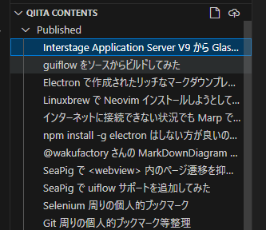

# VS Code Qiita Editor

[Qiita CLI](https://qiita.com/Qiita/items/666e190490d0af90a92b) を VS Code に統合する非公式の拡張です。

[VS Code Zenn Editor](https://marketplace.visualstudio.com/items?itemName=negokaz.zenn-editor) を参考に開発しています。

開発について、以下に記事を書きました。

- [qiita-cli を VSCode に統合する拡張機能が欲しい #Markdown - Qiita](https://qiita.com/yasumichi/items/dffcff0287e8efc11a3d)
- [VS Code Qiita Editor から npx qiita new を呼び出しテキストエディタで開くまで #TypeScript - Qiita](https://qiita.com/yasumichi/items/163a9f2c451ad6fcb9c8)
- [VS Code Qiita Editor から npx qiita publish を呼び出すテスト #VSCode - Qiita](https://qiita.com/yasumichi/items/89a1d1b39c365ff0e9fd)

## Features

- 投稿記事を `title` で一覧表示できます
- 投稿記事を作成できます
- 編集中の記事を Qiita に投稿・更新できます
- ファイルアップロードのページを外部ブラウザで開けます

## Usage

### 編集する投稿コンテンツをタイトルで選択する

Explorer にある「QIITA CONTENTS」ビューで投稿コンテンツの一覧を確認できます。

コンテンツをクリックするとテキストエディタが開きます。

### 新規記事の作成

QIITA CONTENTS ビュー上の紙のアイコンをクリックするか、コマンドパレットから `Qiita Editor: Create New` を実行します。

新規作成されたファイルは、`Drafts` に追加され、テキストエディタが開きます。

### 編集中の記事を投稿

public フォルダにあるマークダウンをテキストエディタで開くとタイトルバーにアンテナから電波が出ている `broadcast` アイコンが表示されます。

`broadcast` アイコンをクリックすると編集中の記事を Qiita に投稿・更新できます。

### ファイルアップロードのページを外部ブラウザで開く

QIITA CONTENTS ビュー上の `cloud-upload` アイコンをクリックします。

信頼されているドメインとして構成されていない場合は、下図のダイアログが開きますので `開く` をクリックします。

外部ブラウザで[ファイルのアップロード - Qiita](https://qiita.com/settings/uploading_images)が開かれます。

## Requirements

[Qiita CLI](https://qiita.com/Qiita/items/666e190490d0af90a92b) がインストールされているフォルダで有効化されます。

※今のところ、`qiita.config.json` が存在すれば、有効化されます。

## Extension Settings

今のところ、設定項目は存在しません。
